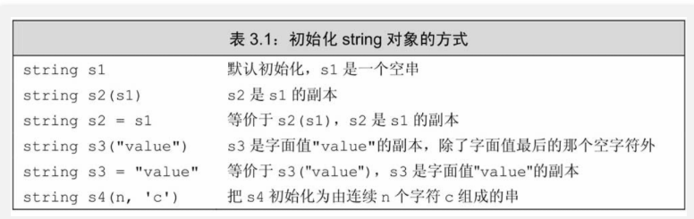
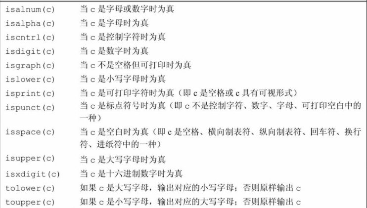

# string类

## 定义与初始化

- 使用部分初始化

`std::string str2(str1, pos, n)`

## 输入输出

- 使用cin, cout

- 读取包含空格的整行字符串

~~~c++
    std::string line;
    std::cout << "请输入一行文本：";
    std::getline(std::cin, line);
    std::cout << "您输入的文本是：" << line << std::endl;
~~~

## 字符串操作

- 拼接与连接

~~~c++
使用+
使用append
~~~

- 比较字符串

- 查找与替换

1. 使用find()查找子串

~~~c++
    std::string text = "The quick brown fox jumps over the lazy dog.";
    std::string word = "fox";

    size_t pos = text.find(word);
    if (pos != std::string::npos) {
        std::cout << "找到 '" << word << "' 在位置: " << pos << std::endl;
    } else {
        std::cout << "'" << word << "' 未找到。" << std::endl;
    }
~~~

2. 替换子串

~~~c++
    std::string text = "I like cats.";
    std::string from = "cats";
    std::string to = "dogs";

    size_t pos = text.find(from);
    if (pos != std::string::npos) {
        text.replace(pos, from.length(), to);
        std::cout << "替换后: " << text << std::endl; // 输出: I like dogs.
    } else {
        std::cout << "'" << from << "' 未找到。" << std::endl;
    }
~~~

- 子串与切片

`std::string sub = str.substr(7, 5); // 从位置7开始，长度5`
`std::string sub = str.substr(7); // 从位置7开始直到结束`

## 字符串的常用成员函数

1. 长度与容量

~~~c++
str.length()
str.size()

// 每个 std::string 对象都有一个容量（capacity），表示它当前能够持有的最大字符数，而不需要重新分配内存
str.capacity()
~~~

2. 访问字符

~~~c++
str[i]
str.at()    // 包含边界检查

    std::string str = "ABCDE";
    try {
        char c = str.at(10); // 超出范围，会抛出异常
    } catch (const std::out_of_range& e) {
        std::cout << "异常捕获: " << e.what() << std::endl;
    }
~~~

3. 转换大小写

~~~c++
#include <iostream>
#include <string>
#include <algorithm>
#include <cctype>

int main() {
    std::string str = "Hello, World!";
    std::transform(str.begin(), str.end(), str.begin(), 
                    { return std::toupper(c); });
    std::cout << str << std::endl; // 输出: HELLO, WORLD!
    return 0;
}
~~~

4. cctype头文件中和函数

5. 其他常用函数

~~~c++
empty()
clear()
erase(pos, n)
insert(pos, "str")  // 在插入位置前面插入

find_first_of(), find_last_of()：查找字符集合中的任何一个字符。

std::string str = "apple, banana, cherry";
size_t pos = str.find_first_of(", ");
std::cout << "第一个逗号或空格的位置: " << pos << std::endl; // 输出: 5
~~~

## stringstream

- std::stringstream 是 C++ 标准库中第 <sstream> 头文件提供的一个类，用于在内存中进行字符串的读写操作，类似于文件流。

- 基本用法示例：

~~~c++
#include <iostream>
#include <sstream>
#include <string>

int main() {
std::stringstream ss;
ss << "Value: " << 42 << ", " << 3.14;

    std::string result = ss.str();
    std::cout << result << std::endl; // 输出: Value: 42, 3.14

    return 0;
}
~~~

- 从字符串流中读取数据：

~~~c++
#include <iostream>
#include <sstream>
#include <string>

int main() {
std::string data = "123 45.67 Hello";
std::stringstream ss(data);

    int a;
    double b;
    std::string c;

    ss >> a >> b >> c;

    std::cout << "a: " << a << ", b: " << b << ", c: " << c << std::endl;
    // 输出: a: 123, b: 45.67, c: Hello

    return 0;
}
~~~

- 字符串与其他数据类型的转换

1. 将其他类型转换为 std::string：

~~~c++
使用 std::to_string()：

#include <iostream>
#include <string>

int main() {
int num = 100;
double pi = 3.14159;

    std::string str1 = std::to_string(num);
    std::string str2 = std::to_string(pi);

    std::cout << "str1: " << str1 << ", str2: " << str2 << std::endl;
    // 输出: str1: 100, str2: 3.141590
    return 0;
}
~~~

2. 将 std::string 转换为其他类型：

~~~c++
// 使用字符串流：

#include <iostream>
#include <sstream>
#include <string>

int main() {
std::string numStr = "256";
std::string piStr = "3.14";

    int num;
    double pi;

    std::stringstream ss1(numStr);
    ss1 >> num;

    std::stringstream ss2(piStr);
    ss2 >> pi;

    std::cout << "num: " << num << ", pi: " << pi << std::endl;
    // 输出: num: 256, pi: 3.14
    return 0;
}

// 使用 std::stoi(), std::stod() 等函数（C++11 及以上）：

#include <iostream>
#include <string>

int main() {
std::string numStr = "256";
std::string piStr = "3.14";

    int num = std::stoi(numStr);
    double pi = std::stod(piStr);

    std::cout << "num: " << num << ", pi: " << pi << std::endl;
    // 输出: num: 256, pi: 3.14
    return 0;
}
~~~

## 与C风格字符串的转换

~~~C++
    const char* cstr = "Hello, C-strings!";
    std::string str(cstr);
    
    // 返回的指针是只读的，且指向的内存由 std::string 管理，确保在 std::string 对象有效期间使用。
    std::string str = "Hello, std::string!";
    const char* cstr = str.c_str();
~~~

## 正则表达式

`#include <regex>`