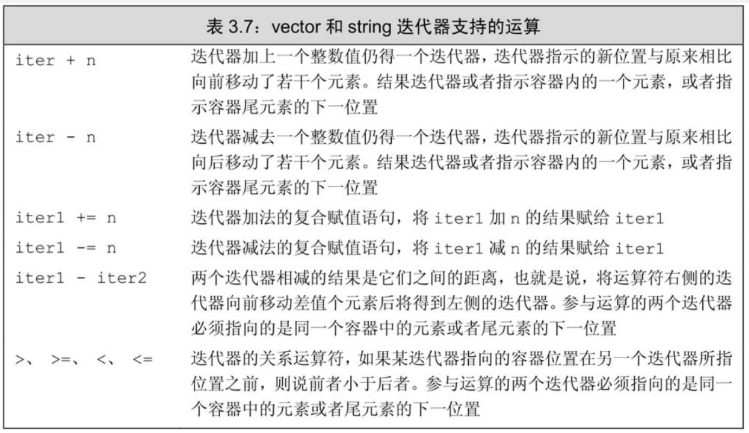

# 迭代器

## 简介

- **迭代器(Iterator)**是C++标准模板库（STL）中的一个重要概念，它提供了一种方法，按顺序访问容器（如vector, list, map等）中的元素， 而无需暴露容器的内部表示。迭代器就像是一个指针，但它比指针更加安全，因为它只能访问容器内的元素，并且它的类型与容器紧密相关。

- begin成员负责返回指向第一个元素（或第一个字符）的迭代器，end成员则负责返回指向容器（或string对象）尾元素的下一位置。

- 特殊情况下如果容器为空，则begin和end返回的是同一个迭代器。

- `auto b = v.begin(), e = v.end(); //b和e的类型相同`

- 迭代器的操作与指针类似

## 迭代器运算

- 如果两个迭代器指向的元素相同或者都是同一个容器的尾后迭代器，则它们相等；否则就说这两个迭代器不相等。

- 自增

~~~C++
// 把字符串中的第一个单词改为大写
std::string s2 = "another string";
for(auto it = s2.begin(); it != s2.end() &&
    !isspace(*it); ++it) {
    *it = toupper(*it);
}
std::cout << s2 << std::endl;
~~~

~~~C++
std::vector<int> numbers = {1, 2, 3, 4, 5};
//中间位置的迭代器
auto mid = numbers.begin() + numbers.size()/2;
//判断迭代器是否有效
if(mid != numbers.end()){
    std::cout << *mid << std::endl;
}else{
    std::cout << "mid is end" << std::endl;
}
~~~

## 泛型编程

- 迭代器是泛型编程的核心概念之一。它允许我们编写与容器类型无关的代码，从而使得算法可以应用于任何支持迭代器的容器。

- 养成使用迭代器和！=的习惯，就不用太在意用的到底是哪种容器类型。

## 迭代器类型

- 拥有迭代器的标准库类型使用`iterator`和`const_iterator`来表示迭代器的类型。

- 如果vector对象或string对象是一个常量，只能使用const_iterator；如果vector对象或string对象不是常量，那么既能使用iterator也能使用const_iterator。

~~~C++
std::vector<int> numbers = {1, 2, 3, 4, 5};

// 使用 const_iterator 遍历
std::vector<int>::const_iterator it;
for (it = numbers.cbegin(); it != numbers.cend(); ++it) {
    std::cout << *it << " ";  // 读取元素值
}
std::cout << std::endl;
~~~

- begin和end返回的具体类型由对象是否是常量决定，如果对象是常量，begin和end返回const_iterator；如果对象不是常量，返回iterator。

- 如果一个容器非常量，我们也可以通过分别是cbegin和cend：获取对应的常量迭代器。

~~~C++
//it3的类型是vector<int>::const_iterator
auto it3 = v.cbegin();
~~~

## 迭代器失效

- 任何一种可能改变vector对象容量的操作，比如push_back，都会使该vector对象的迭代器失效。

~~~C++
//注意下面逻辑错误，在for循环中push元素导致死循环
std::vector<int> numbers = {1, 2, 3, 4, 5};
for(auto i = 0; i < numbers.size(); ++i) {
    numbers.push_back(i);
}

//注意下面逻辑错误，在for循环中push元素导致迭代器失效,也会导致死循环
for(auto it = numbers.begin(); it != numbers.end(); ++it) {
    numbers.push_back(1);
}
~~~

- 以通过vector的erase操作删除迭代器指向的元素，erase会返回删除元素的下一个元素的迭代器

~~~C++
// vector容器存储了一系列数字，在循环中遍历每一个元素，并且删除其中的奇数，要求循环结束，vector元素为偶数，要求时间复杂度o(n)

    std::vector<int> numbers = {1, 2, 3, 4, 5};
    //循环遍历,并删除其中奇数
    for(auto it = numbers.begin(); it != numbers.end(); ) {
        // 删除奇数
        if(*it % 2 != 0){
            it = numbers.erase(it);
            continue;
        }
        ++it;
    }
    
    for(auto num : numbers) {
        std::cout << num << " ";
    }
    
    std::cout << std::endl;
~~~

## 使用迭代器运算

~~~C++
std::vector<int> numbers = {1, 2, 3, 4, 5};
//二分查找4所在的迭代器为止
auto beg = numbers.begin(), end = numbers.end();
auto mid = beg + (end - beg) / 2;
//二分查找
while(mid != end && *mid != 4){
    //4在mid的右边
    if(*mid < 4){
        beg = mid + 1;
    }else{ //4在mid的左边
        end = mid;
    }
    mid = beg + (end - beg) / 2;

}

if(mid != end){
    std::cout << "4 is found" << std::endl;
}else{
    std::cout << "4 is not found" << std::endl;
}
~~~

## 示例代码

~~~C++
#include <iostream>
#include <vector>

int main() {
    std::vector<int> numbers;
    int input;

    std::cout << "请输入一组整数（输入-1结束输入）：\n";
    while (std::cin >> input && input != -1) {
        numbers.push_back(input);
    }

    std::cout << "反向打印结果：";
    for (std::vector<int>::reverse_iterator it = numbers.rbegin(); it != numbers.rend(); ++it) {
        std::cout << *it << " ";
    }
    std::cout << std::endl;

    return 0;
}
~~~

- rbegin()：返回指向最后一个元素的反向迭代器

- rend()：返回指向第一个元素之前位置的反向迭代器
  
- ++it：向前移动（实际上是向容器开头移动）

~~~C++
// insert(插入位置, 源范围开始, 源范围结束)
mergedVector.insert(mergedVector.end(), vector1.begin(), vector1.end());
~~~